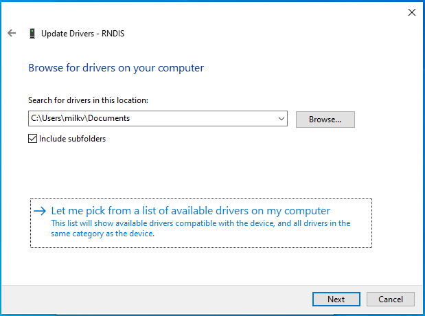
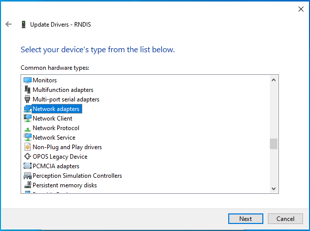
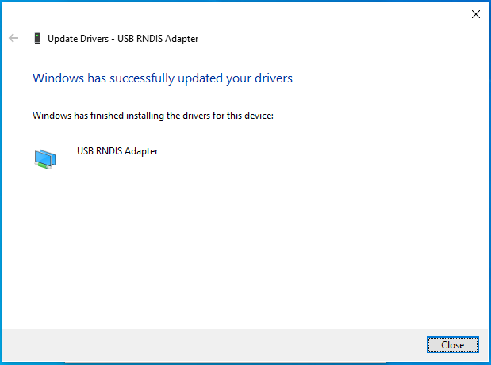
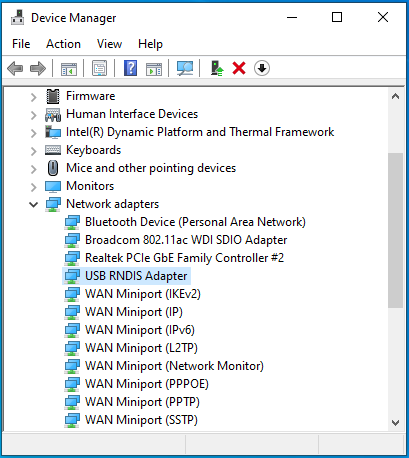

# Duo 人脸识别

人脸识别程序已经在官方镜像的 path 中，若要自行搭建可看：
https://milkv.io/zh/docs/duo/application-development/tdl-sdk/tdl-sdk-face-detection

## RNDIS 使用

使用线缆链接 Duo 和电脑。**若使用底板会关闭 RDNIS，直接使用普通以太网就行**

### Linux

首先确认你的系统开启了 RNDIS：

```bash
lsmod | grep rndis
```
应该出现：
```txt
rndis_host             24576  0
cdc_ether              24576  1 rndis_host
usbnet                 65536  2 rndis_host,cdc_ether
```


若什么都没有出现，需要添加几个模块：
```bash
sudo modprobe usbnet
sudo modprobe rndis_host
```
然后现在你应当看到模块了。

### Windows

"RNDIS" 设备出现在设备管理器中。


选择 "RNDIS "并右键单击以更新驱动程序。


选择 "Browse my computer for drivers"


选择 "Let me pick from a list of available drivers on my computer"


选择 "Network adapters"


Manufacturer/Model: Microsoft/USB RNDIS Adapter


忽略警告信息


驱动程序更新成功


检查 "USB RNDIS Adapter"



## 运行

**不是 RDNIS 链接请自行更换 IP**

直接：
```bash
ssh root@192.168.42.1 # 密码：milkv
camera-test.sh
```

## 连接视频流

ffmpeg 方法：
```bash
ffplay rtsp://192.168.42.1/h264
```

VLC 方法：
打开 VLC media player，点击左上角 Media，选择 Open Network Stream，输入 URL，地址为：
`rtsp://192.168.42.1/h264`
