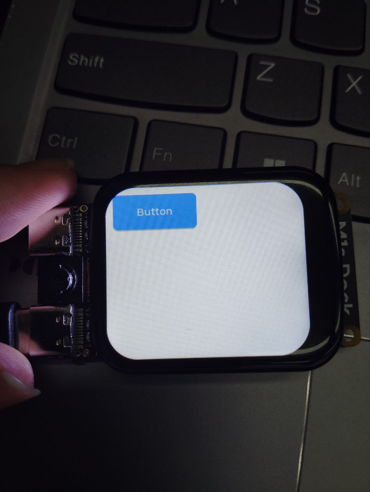

# LVGL on M1s Dock

## 简介

LVGL 是一款在嵌入式设备上被广泛使用的轻量级图形库，其具有动画流畅，图形精美的各类图形元素和组件，并原生支持多种输入设备。同时，其具有低内存占用和空间使用的特点。
其全部由 C 组成，且支持简单的 C/C++/Micropython 的调用。

在 BL808 的 SDK 中集成了 LVGL 库，使得可以简单的使用 LVGL 写出图形界面。

## 搭建开发环境

以下刷写方案均基于 UART 自动刷写完成。该方式局限性较小，且在 Linux/Windows 通用。

对于其它的刷写方案，详见 [Sipeed Wiki](https://wiki.sipeed.com/hardware/zh/maix/m1s/other/start.html#%E7%83%A7%E5%BD%95%E6%96%B9%E6%B3%95)，需注意其中如 U 盘方式在 Linux 上可能不可使用。

### 获取 SDK

创建 SDK 工作区：
```bash
mkdir -p bl808
cd bl808
git clone https://github.com/sipeed/M1s_BL808_SDK.git
git clone https://github.com/sipeed/M1s_BL808_example.git
cd M1s_BL808_example
ln -s ../M1s_BL808_SDK ./
cd ..
```

请注意 example 为必须获取的，其中含有固件代码。

获取 SDK，需在 [Sipeed](https://dl.sipeed.com/shareURL/others/toolchain) 处手动下载，而后进行如下操作：
```bash
mkdir -p M1s_BL808_SDK/toolchain
tar -zxvf path/to/Xuantie-900-gcc-elf-newlib-x86_64-V2.2.4-20220715.tar.gz -C M1s_BL808_SDK/toolchain/
cd M1s_BL808_SDK/toolchain
mv Xuantie-900-gcc-elf-newlib-x86_64-V2.2.4/ Linux_x86_64
cd ../..
export BL_SDK_PATH=$(pwd)/M1s_BL808_SDK
# persist it: 
# echo "export BL_SDK_PATH=$(pwd)/M1s_BL808_SDK" >> ~/.bashrc
# source ~/.bashrc
```

### 编译固件

由于 Sipeed 不再提供最新版固件，我们必须手动编译固件来进行使用。
假定现在在之前创建的 bl808 目录下：
```bash
cd M1s_BL808_example/e907_app/
./build.sh firmware
```

固件编译在 `build_out/firmware.bin` 处。

### 获取烧写程序

获取 UART 烧写程序，其中包含命令行与图形界面。同时在此步还会获取如分区表、另一部分 M1s Dock 的固件。

同样，假定我们目前在 `bl808` 目录下：
```bash
wget https://dl.sipeed.com/fileList/MAIX/M1s/M1s_Dock/7_Firmware/partition/partition_cfg_16M_m1sdock.toml
wget https://dev.bouffalolab.com/media/upload/download/BouffaloLabDevCube-v1.9.0.zip
mkdir cube
unzip BouffaloLabDevCube-v1.9.0.zip -d cube
chmod +x cube/bflb_iot_tool-ubuntu cube/BLDevCube-ubuntu
```

其中，`cube/bflb_iot_tool-ubuntu` 是 Linux 下命令行烧录程序，`cube/BLDevCube-ubuntu` 是图形界面的。其余系统同理。

### 刷写固件

使用 type-c 线连接 **UART** 口和电脑，按住 BOOT+RST，先放开 RST，再放开 BOOT，进入刷写模式。

回到 bl808 目录下，或许需要根据实际替换各个路径：
```bash
cube/bflb_iot_tool-ubuntu --chipname=bl808 --port=/dev/ttyUSB1 --baudrate=2000000 --boot2="cube/chips/bl808/builtin_imgs/boot2_isp_bl808_v6.6.1/boot2_isp_debug.bin" --pt="partition_cfg_16M_m1sdock.toml" --firmware="M1s_BL808_example/e907_app/build_out/firmware.bin" --d0fw="M1s_BL808_example/c906_app/build_out/d0fw.bin"
```

## LVGL Demo

### Sipeed 官方 Demo

Sipeed 官方提供了一个 Demo，代码位于 `M1s_BL808_example/c906_app/lvgl_demo` 下。以此 demo 展示如何使用该 SDK 进行编写和构建，及如何进行刷写。

#### 构建

构建过程：
```bash
cd M1s_BL808_example/c906_app
./build.sh lvgl_demo
```

生成的文件位于 `build_out/lvgl_demo.bin`

#### 刷写程序

使用 type-c 线连接 **UART** 口和电脑，按住 BOOT+RST，先放开 RST，再放开 BOOT，进入刷写模式。

回到 bl808 目录下，或许需要根据实际替换各个路径：
```bash
cube/bflb_iot_tool-ubuntu --chipname=bl808 --port=/dev/ttyUSB1 --baudrate=2000000 --firmware="M1s_BL808_example/c906_app/build_out/lvgl_demo.bin" --addr 0x101000 --single
```

不要忘了按一下 rst

#### 预期结果

编译过程见命令行录制：
[](https://asciinema.org/a/KqXwgFH8trIweo9bRd79hZyV9)


运行结果：
[Video](./assets/1.mp4)

---

以下对于新工程如何配置：

### 编译命令及 Makefile


M1s Dock 工程一般具有如下结构：
```text
projects
 |
 |-- Makefile # 全部的 Makefile
 |
 |-- proj_config.mk # 该开发板的配置文件
 |
 |-- proj1 # 具体的 Project
 |      |
        |-- bouffalo.mk # 具体 Project 的 Make 配置，一般可以为空
```

**需要特别注意，Makefile 和 proj_config.mk 在你具体工程的上级目录！**

Makefile 如下：
```makefile
PROJECT_NAME ?= proj_name
PROJECT_PATH = $(abspath .)
PROJECT_BOARD := evb
export PROJECT_PATH PROJECT_BOARD

-include ./proj_config.mk

ifeq ($(origin BL_SDK_PATH), undefined)
$(error   BL_SDK_PATH not found, please enter: export BL_SDK_PATH={sdk_path})
endif

INCLUDE_COMPONENTS += bl808_c906_freertos bl808 bl808_std newlibc hosal freetype yloop cli utils
INCLUDE_COMPONENTS += blai_nn blai_npu_encoder
INCLUDE_COMPONENTS += bl_mm venc_device venc_framework 
INCLUDE_COMPONENTS += freertos_posix
INCLUDE_COMPONENTS += blog
INCLUDE_COMPONENTS += vfs lvgl lwip
INCLUDE_COMPONENTS += blfdt romfs fatfs sdh_helper 
INCLUDE_COMPONENTS += bl808_ring bl808_xram bl_os_adapter
INCLUDE_COMPONENTS += dsp2 bl_mm venc_device venc_framework dsp2_cli_demo mjpeg_sender_bl808 sensor rtsp_server

COMPONENTS_SIPEEED :=
COMPONENTS_SIPEEED += m1s_start
COMPONENTS_SIPEEED += m1s_model_runner
COMPONENTS_SIPEEED += m1s_tools
COMPONENTS_SIPEEED += lfs m1s_lfs_c906
COMPONENTS_SIPEEED += m1s_common_xram m1s_c906_xram
INCLUDE_COMPONENTS += $(COMPONENTS_SIPEEED)
INCLUDE_COMPONENTS += $(PROJECT_NAME)

CFLAGS += -DROMFS_STATIC_ROOTADDR=0x582f0000

include $(BL_SDK_PATH)/make_scripts_riscv/project_common.mk
```

proj_config.mk 配置如下：
```makefile
#
#compiler flag config domain
#
#CONFIG_TOOLPREFIX :=
#CONFIG_OPTIMIZATION_LEVEL_RELEASE := 1
#CONFIG_M4_SOFTFP := 1

#
#board config domain
#
CONFIG_BOARD_FLASH_SIZE := 2

#firmware config domain
#

#set CONFIG_ENABLE_ACP to 1 to enable ACP, set to 0 or comment this line to disable
#CONFIG_ENABLE_ACP:=1
CONFIG_BL_IOT_FW_AP:=1
CONFIG_BL_IOT_FW_AMPDU:=0
CONFIG_BL_IOT_FW_AMSDU:=0
CONFIG_BL_IOT_FW_P2P:=0
CONFIG_ENABLE_PSM_RAM:=1
#CONFIG_ENABLE_CAMERA:=1
#CONFIG_ENABLE_BLSYNC:=1
#CONFIG_ENABLE_VFS_SPI:=1
CONFIG_ENABLE_VFS_ROMFS:=1
CONFIG_ENABLE_DBG_UARTID_0:=1

CONFIG_ENABLE_ETHMAC:=0
CONFIG_ENABLE_YUV_CAM:=1
CONFIG_CPU_C906:=1
# set easyflash env psm size, only support 4K、8K、16K options
CONFIG_ENABLE_PSM_EF_SIZE:=16K

CONFIG_FREERTOS_TICKLESS_MODE:=0

CONFIG_BT:=0
CONFIG_BT_CENTRAL:=1
CONFIG_BT_OBSERVER:=1
CONFIG_BT_PERIPHERAL:=1
CONFIG_BT_STACK_CLI:=1
#CONFIG_BT_MESH := 1
CONFIG_BLE_STACK_DBG_PRINT := 1
CONFIG_BT_STACK_PTS := 0
ifeq ($(CONFIG_BT_MESH),1)
CONFIG_BT_MESH_PB_ADV := 1
CONFIG_BT_MESH_PB_GATT := 1
CONFIG_BT_MESH_FRIEND := 1
CONFIG_BT_MESH_LOW_POWER := 1
CONFIG_BT_MESH_PROXY := 1
CONFIG_BT_MESH_GATT_PROXY := 1
endif

#blog enable components format :=blog_testc cli vfs helper
LOG_ENABLED_COMPONENTS:=blog_testc hosal loopset looprt bloop

```

编译命令则如下：
```bash
make CONFIG_CHIP_NAME=BL808 CPU_ID=D0 -j$(nproc) PROJECT_NAME=$(你的具体工程文件夹名)
```

### LVGL Widgits

按上文中配置完环境后，首先需要打开 Widgets 的 demo，位于 `M1s_BL808_SDK/components/lvgl/lvgl/lv_conf.h` 748 行。

程序如下：
```c
#include <bl808_glb.h>


#include "lv_port_disp.h"
#include "lv_port_indev.h"
#include "lvgl.h"


#define LV_USE_DEMO_WIDGETS 1
#include "demos/widgets/lv_demo_widgets.h"

void main()
{
        lv_init();
        lv_port_disp_init();
        lv_port_indev_init();

        lv_demo_widgets();

        while(1) {
            lv_task_handler();
        }
}
```

#### 预期结果

运行结果：


---

以下为：LVGL 官方提供的 demo，代码位于 https://github.com/lvgl/lvgl 中的 example 中。可以 clong 下来并按照下方 M1s Dock 来配置工程。

**注意请使用 v8.0 版本的 lvgl！**

一般而言，将官方 demo 放在 main 函数中调用，即可。以几个 demo 作为示例：

### LVGL Button

程序如下：
```c
#include <bl808_glb.h>


#include "lv_port_disp.h"
#include "lv_port_indev.h"
#include "lvgl.h"

static void btn_event_cb(lv_event_t * e)
{
    lv_event_code_t code = lv_event_get_code(e);
    lv_obj_t * btn = lv_event_get_target(e);
    if(code == LV_EVENT_CLICKED) {
        static uint8_t cnt = 0;
        cnt++;

        /*Get the first child of the button which is the label and change its text*/
        lv_obj_t * label = lv_obj_get_child(btn, 0);
        lv_label_set_text_fmt(label, "Button: %d", cnt);
    }
}

/**
 * Create a button with a label and react on click event.
 */
void lv_example_get_started_1(void)
{
    lv_obj_t * btn = lv_btn_create(lv_scr_act());     /*Add a button the current screen*/
    lv_obj_set_pos(btn, 10, 10);                            /*Set its position*/
    lv_obj_set_size(btn, 120, 50);                          /*Set its size*/
    lv_obj_add_event_cb(btn, btn_event_cb, LV_EVENT_ALL, NULL);           /*Assign a callback to the button*/

    lv_obj_t * label = lv_label_create(btn);          /*Add a label to the button*/
    lv_label_set_text(label, "Button");                     /*Set the labels text*/
    lv_obj_center(label);
}

void main()
{
        lv_init();
        lv_port_disp_init();
        lv_port_indev_init();

        lv_example_get_started_1();

        while(1) {
            lv_task_handler();
        }
}

```

#### 预期结果

运行结果：



### LVGL 动画

程序如下：
```C
#include <bl808_glb.h>


#include "lv_port_disp.h"
#include "lv_port_indev.h"
#include "lvgl.h"

static void anim_x_cb(void * var, int32_t v)
{
    lv_obj_set_x(var, v);
}

static void anim_size_cb(void * var, int32_t v)
{
    lv_obj_set_size(var, v, v);
}

/**
 * Create a playback animation
 */
void lv_example_anim_2(void)
{

    lv_obj_t * obj = lv_obj_create(lv_scr_act());
    lv_obj_set_style_bg_color(obj, lv_palette_main(LV_PALETTE_RED), 0);
    lv_obj_set_style_radius(obj, LV_RADIUS_CIRCLE, 0);

    lv_obj_align(obj, LV_ALIGN_LEFT_MID, 10, 0);

    lv_anim_t a;
    lv_anim_init(&a);
    lv_anim_set_var(&a, obj);
    lv_anim_set_values(&a, 10, 50);
    lv_anim_set_time(&a, 1000);
    lv_anim_set_playback_delay(&a, 100);
    lv_anim_set_playback_time(&a, 300);
    lv_anim_set_repeat_delay(&a, 500);
    lv_anim_set_repeat_count(&a, LV_ANIM_REPEAT_INFINITE);
    lv_anim_set_path_cb(&a, lv_anim_path_ease_in_out);

    lv_anim_set_exec_cb(&a, anim_size_cb);
    lv_anim_start(&a);
    lv_anim_set_exec_cb(&a, anim_x_cb);
    lv_anim_set_values(&a, 10, 240);
    lv_anim_start(&a);
}

void main()
{
        lv_init();
        lv_port_disp_init();
        lv_port_indev_init();

        lv_example_anim_2();

        while (1) {
                lv_task_handler();
        }
}

```

#### 预期结果

运行结果：
[Video](./assets/4.mp4)

