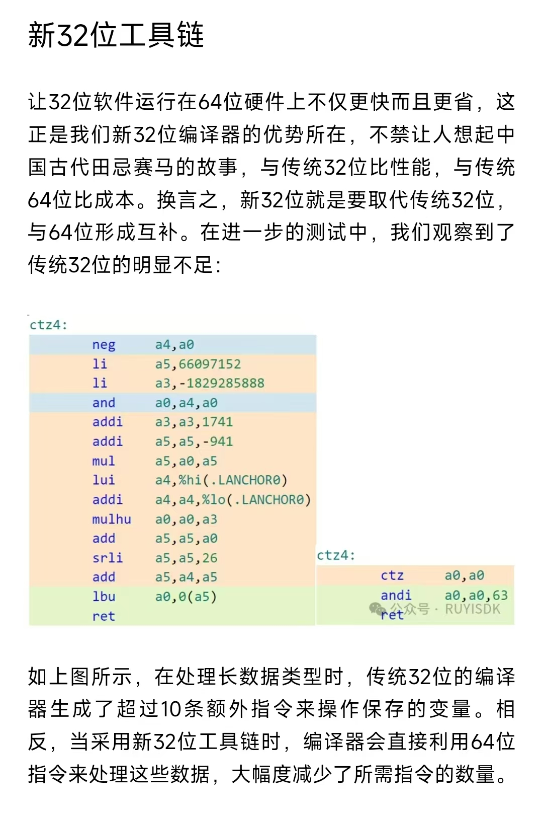

# 简介

## RuyiSDK

- 由 PLCT Lab 制作的一款一站式的开发解决方案。包含了多个组成部分。
  - 包管理器
  - 工具链
  - 操作系统安装工具
  - IDE
  - 操作系统
  - ...
- 专为 RISC-V 开发者打造的全方位、集成式全功能开发环境， 打通RISC-V开发流程， 解决开发痛点
- 官网：[https://ruyisdk.org/](https://ruyisdk.org/)

## 测试目的

RuyiSDK 中带有了多个工具链：

- GNU Upstream：上游GNU工具链，GCC 13.2.0
- GNU PLCT：PLCT Lab 定制的GNU工具链，包含有非官方指令集扩展等，GCC 13.1.0
- 产商工具链：一些产商提供的工具链
  - GNU PLCT Xthead：基于由玄铁提供的，为玄铁工具优化的工具链，GCC 10.4.0

## 测试硬件平台

目前测试主要覆盖了多个常见的 RISC-V CPU，确保工具链的通用，及扩展指令集的兼容性。

- D1: *c906fdv*
- SpacemiT K1/M1: *X60*
- TH1520: *c910*
- JH7110: *U74*
- K230: *c908*
- SG2042: *c920v2*
- CV1800B: *c906fdv*
- SG2000/SG2002: *c906fdv*

基本覆盖了常见的 RISC-V CPU/SOC。

# 测试准备

## 测试环境

Ruyi 工具具有虚拟环境功能，方便隔离、切换不同的工具链，测试环境可一键由工具提供的虚拟环境搭建而成。

可直接使用预编译好的 Ruyi 工具：

```bash
wget https://mirror.iscas.ac.cn/ruyisdk/ruyi/releases/0.29.0/ruyi.riscv64
chmod +x ruyi.riscv64
sudo mv ruyi.riscv64 /usr/bin/ruyi
```

---

虚拟工具链环境的使用，可直接使用 `ruyi` 下载对应的工具链：

```bash
ruyi install toolchain/gnu-upstream
ruyi install toolchain/gnu-plct
ruyi install toolchain/gnu-plct-xthead
```

而后创建虚拟环境：

```bash
ruyi venv -t toolchain/gnu-upstream generic venv-gnu-upstream
ruyi venv -t toolchain/gnu-plct generic venv-gnu-plct
ruyi venv -t toolchain/gnu-plct-xthead generic venv-gnu-plct-xthead
```

---

要使用虚拟环境，只需：

```bash
source venv-gnu-upstream/bin/ruyi-activate
```

而后可以看到命令行提示符发生了变化，表明当前环境已经切换到了 `gnu-upstream` 工具链。

```log
debian@revyos-lpi4a:~$ source ~/venv-gnu-upstream/bin/ruyi-activate
«Ruyi venv-gnu-upstream» debian@revyos-lpi4a:~$ 
```

# 测试过程

## 工具链可用性

在切换到一个虚拟环境后，首先通过一个简单的 `hello world` 程序测试工具链的可用性。

```bash
cat > hello.c <<EOF
#include <stdio.h>
int main() {
    printf("Hello, world!\n");
    return 0;
}
EOF

riscv64-unknown-linux-gnu-gcc -o hello hello.c
. /hello
```

可以确认，所有的工具链都可用。

## 工具链扩展测试

为了测试工具扩展，通过 `coremark` 测试不同编译选项及运行结果。

| 工具链 | CPU | march | option |
| --- | --- | --- |
| GNU Upstream | * | rv64gc |
| GNU PLCT | * | rv64gc |
| GNU PLCT | CV1800B | rv64gc | -static *cross compile* |
| GNU PLCT | JH7110 | rv64gc_zba_zbb_zbc | -mabi=lp64d |
| GNU PLCT | K1/M1 | rv64gcv_zvl256b | -mabi=lp64d |
| GNU PLCT | SG2000 | rv64gc | -static *cross compile* |
| GNU PLCT | SG2042 | rv64gc_xtheadvector_xtheadba_xtheadbb_xtheadbs | -mabi=lp64d |
| GNU PLCT | TH1520 | rv64gc_xtheadvector_xtheadba_xtheadbb_xtheadbs | -mabi=lp64d |
| GNU PLCT Xthead | TH1520 | rv64gc_v0p7_xtheadc | -mtune=c910 |

---

`coremark` 测试源码可以通过 `ruyi` 工具下载：

```bash
ruyi extract coremark
```

而后替换工具链：

```bash
sed -i 's/\bgcc\b/riscv64-unknown-linux-gnu-gcc/g' linux64/core_portme.mak
```

最后编译：

```bash
make PORT_DIR=linux64 XCFLAGS="..." link
``` 

# 测试结果

## 非标准指令集扩展支持

```log
$ make PORT_DIR=linux64 link XCFLAGS="-march=rv64gc_xtheadvector_xtheadba_xtheadbb_xtheadbs"
riscv64-unknown-linux-gnu-gcc -O2 -Ilinux64 -I. -DFLAGS_STR=\""-O2 -march=rv64gc_xtheadvector_xtheadba_xtheadbb_xtheadbs  -lrt"\" -DITERATIONS=0 -march=rv64gc_xtheadvector_xtheadba_xtheadbb_xtheadbs core_list_join.c core_main.c core_matrix.c core_state.c core_util.c linux64/core_portme.c -o ./coremark.exe -lrt
Assembler messages:
Error: x ISA extension `xtheadvector' must be set with the versions
/tmp/cc4jAaC4.s:3: Error: x ISA extension `xtheadvector' must be set with the versions
Assembler messages:
Error: x ISA extension `xtheadvector' must be set with the versions
/tmp/cc4jAaC4.s:3: Error: x ISA extension `xtheadvector' must be set with the versions
Assembler messages:
Error: x ISA extension `xtheadvector' must be set with the versions
/tmp/cc4jAaC4.s:3: Error: x ISA extension `xtheadvector' must be set with the versions
Assembler messages:
Error: x ISA extension `xtheadvector' must be set with the versions
/tmp/cc4jAaC4.s:3: Error: x ISA extension `xtheadvector' must be set with the versions
Assembler messages:
Error: x ISA extension `xtheadvector' must be set with the versions
/tmp/cc4jAaC4.s:3: Error: x ISA extension `xtheadvector' must be set with the versions
Assembler messages:
Error: x ISA extension `xtheadvector' must be set with the versions
/tmp/cc4jAaC4.s:3: Error: x ISA extension `xtheadvector' must be set with the versions
make: *** [Makefile:88: compile] Error 1
```

可以看到，upstream工具链不支持非标准指令集扩展。

---

```log
$ riscv64-plctxthead-linux-gnu-gcc -v
Using built-in specs.
COLLECT_GCC=/home/debian/.local/share/ruyi/binaries/riscv64/gnu-plct-xthead-2.8.0-ruyi.20240222/bin/riscv64-plctxthead-linux-gnu-gcc
COLLECT_LTO_WRAPPER=/home/debian/.local/share/ruyi/binaries/riscv64/gnu-plct-xthead-2.8.0-ruyi.20240222/bin/../libexec/gcc/riscv64-plctxthead-linux-gnu/10.4.0/lto-wrapper
Target: riscv64-plctxthead-linux-gnu
Configured with: /work/HOST-riscv64-linux-gnu/riscv64-plctxthead-linux-gnu/src/gcc/configure --build=x86_64-build_pc-linux-gnu --host=riscv64-host_unknown-linux-gnu --target=riscv64-plctxthead-linux-gnu --prefix=/opt/ruyi/HOST-riscv64-linux-gnu/riscv64-plctxthead-linux-gnu --exec_prefix=/opt/ruyi/HOST-riscv64-linux-gnu/riscv64-plctxthead-linux-gnu --with-sysroot=/opt/ruyi/HOST-riscv64-linux-gnu/riscv64-plctxthead-linux-gnu/riscv64-plctxthead-linux-gnu/sysroot --enable-languages=c,c++,fortran,objc,obj-c++ --with-arch=rv64gc --with-abi=lp64d --with-pkgversion='RuyiSDK 20240222 T-Head-Sources T-Head-2.8.0' --with-bugurl=https://github.com/ruyisdk/ruyisdk/issues --enable-__cxa_atexit --disable-libmudflap --disable-libgomp --enable-libquadmath --enable-libquadmath-support --disable-libmpx --with-gmp=/work/HOST-riscv64-linux-gnu/riscv64-plctxthead-linux-gnu/buildtools/complibs-host --with-mpfr=/work/HOST-riscv64-linux-gnu/riscv64-plctxthead-linux-gnu/buildtools/complibs-host --with-mpc=/work/HOST-riscv64-linux-gnu/riscv64-plctxthead-linux-gnu/buildtools/complibs-host --with-isl=/work/HOST-riscv64-linux-gnu/riscv64-plctxthead-linux-gnu/buildtools/complibs-host --enable-lto --enable-threads=posix --enable-target-optspace --enable-linker-build-id --with-linker-hash-style=gnu --enable-plugin --disable-nls --enable-multiarch --with-local-prefix=/opt/ruyi/HOST-riscv64-linux-gnu/riscv64-plctxthead-linux-gnu/riscv64-plctxthead-linux-gnu/sysroot --enable-long-long
Thread model: posix
Supported LTO compression algorithms: zlib zstd
gcc version 10.4.0 (RuyiSDK 20240222 T-Head-Sources T-Head-2.8.0) 
```

而 `gnu-plct-xthead` 虽有玄铁定制了指令集扩展，但其版本仅有 `10.4.0`

## ilp32 编译器支持

RuyiSDK 中还拥有支持ilp32的工具链，可以通过 `ruyi` 工具下载：

```bash
ruyi install toolchain/gnu-plct-rv64ilp32-elf
```

在使用ilp32工具链时，可以使得32位的程序使用64位的寄存器，以提高性能。

---



## 测试结果

| 工具链 | CPU | Compiler Option | Result |
| --- | --- | --- | --- |
| GNU Upstream | CV1800B | -O2 -static  -lrt | 2009.780934 |
| GNU PLCT | CV1800B | -O2 -static  -lrt | 2011.937496 |
| GNU Upstream | D1 |  -O2   -lrt | 1165.365342 |
| GNU PLCT | D1 |  -O2   -lrt | 2371.354043 |
| GNU Upstream | JH7110 | -O2   -lrt | 5299.161769 |
| GNU Upstream | JH7110 | -O2 -march=rv64gc_zba_zbb_zbc -mabi=lp64d  -lrt | 5811.803244 |
| GNU PLCT | JH7110 | -O2   -lrt | 5338.769171 |
| GNU PLCT | JH7110 | -O2 -march=rv64gc_zba_zbb_zbc -mabi=lp64d  -lrt | 5724.992193 |

---

| 工具链 | CPU | Compiler Option | Result |
| --- | --- | --- | --- |
| GNU Upstream | K1/M1 | -O2   -lrt | 5692.108668 |
| GNU Upstream | K1/M1 | -O2 -march=rv64gcv_zvl256b -mabi=lp64d  -lrt | 5671.272427 |
| GNU PLCT | K1/M1 | -O2   -lrt | 5680.351149 |
| GNU PLCT | K1/M1 | -O2 -march=rv64gcv_zvl256b -mabi=lp64d  -lrt | 5663.097199 |
| GNU Upstream | K230 | -O2   -lrt | 5432.903640 |
| GNU PLCT | K230 | -O2   -lrt | 5456.078568 |
| GNU Upstream | SG2000 | -O2  -lrt | 2526.954178 | 
| GNU PLCT | SG2000 | -O2  -lrt | 2505.846976 |

---

| 工具链 | CPU | Compiler Option | Result |
| --- | --- | --- | --- |
| GNU Upstream | SG2042 | -O2   -lrt | 8949.637946 |
| GNU PLCT | SG2042 | -O2   -lrt | 9222.771862 |
| GNU PLCT | SG2042 | -O2 -march=rv64gc_xtheadvector_ xtheadba_xtheadbb_xtheadbs  -lrt | 9087.904825 |
| GNU Upstream | TH1520 | -O2   -lrt | 8162.659543 |
| GNU PLCT | TH1520 | -O2   -lrt | 8299.381319 |
| GNU PLCT | TH1520 | -O2 -march=rv64gc_xtheadvector_ xtheadba_xtheadbb_xtheadbs  -lrt | 8344.712487 |
| GNU PLCT XThead | TH1520 | -O2 -march=rv64gc_v0p7_xtheadc -mtune=c910  -lrt | 9743.998583 |