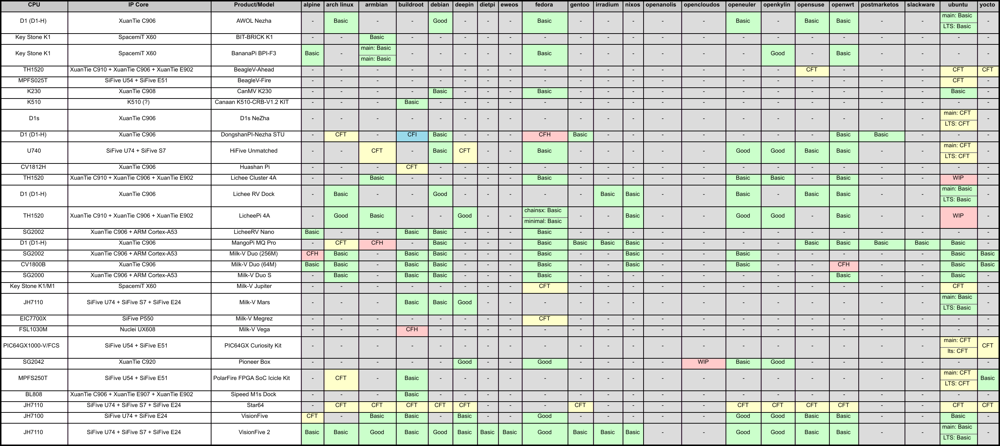
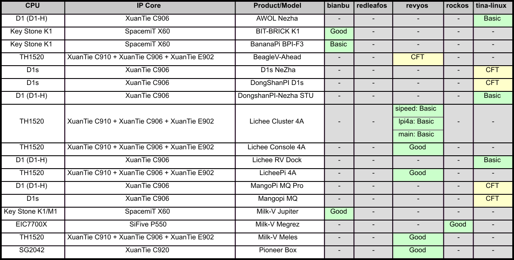
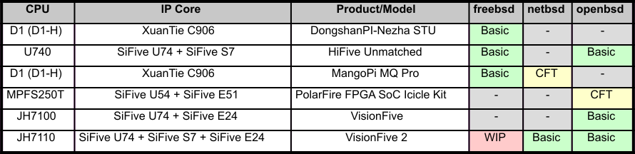
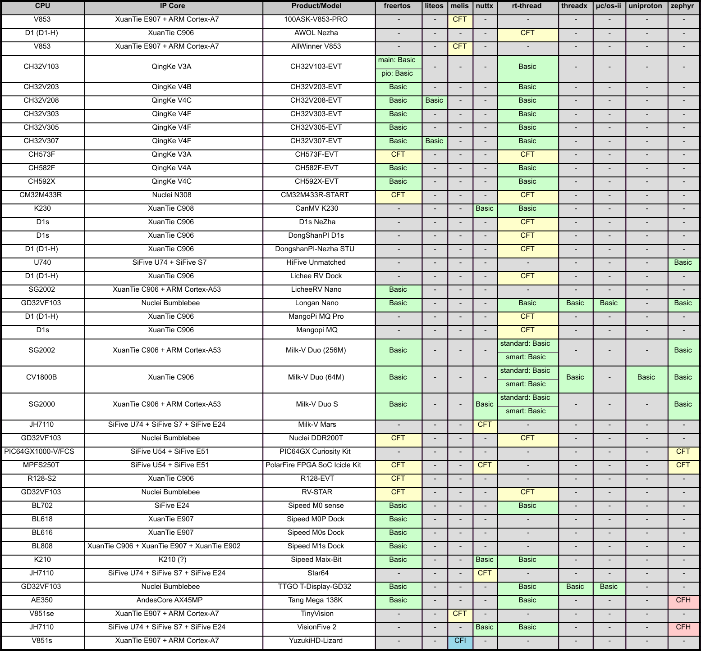

# 简介

## 支持矩阵

- 支持矩阵目前是RISC-V开发板x操作系统的一个支持列表、安装文档和测试结果的一个集合体。
- 包含了市面上常见RISC-V开发板及其镜像的信息
- 拥有各类开发板系统镜像的安装教程
- 开发板开发环境搭建教程
- 对无法工作的镜像给予测试反馈和标明

仓库：[https://github.com/ruyisdk/support-matrix/](https://github.com/ruyisdk/support-matrix/)

---

---

---

---

# 前端

## 支持矩阵前端展示

目前，支持矩阵新的前端已经编写完成。网址目前为：[https://verforte.vercel.app/](https://verforte.vercel.app/)

该前端目前支持：

- 支持矩阵的展示
- 开发板、芯片、镜像搜索
- 最近更新动态
- i18n文档
- ...

# 刷写演示

## 支持矩阵演示

当前支持矩阵中新增了 openHarmony SDK 的支持，可以根据文档在 BPI-F3 上编译、刷写并启动。

*演示*

---

同时，对于某些系统，其本身并未提供镜像，而是需要手动进行构建组装。如 Milk-V Duo256m 上的 openEuler 就可以从这种方式中编译出现。

*演示*