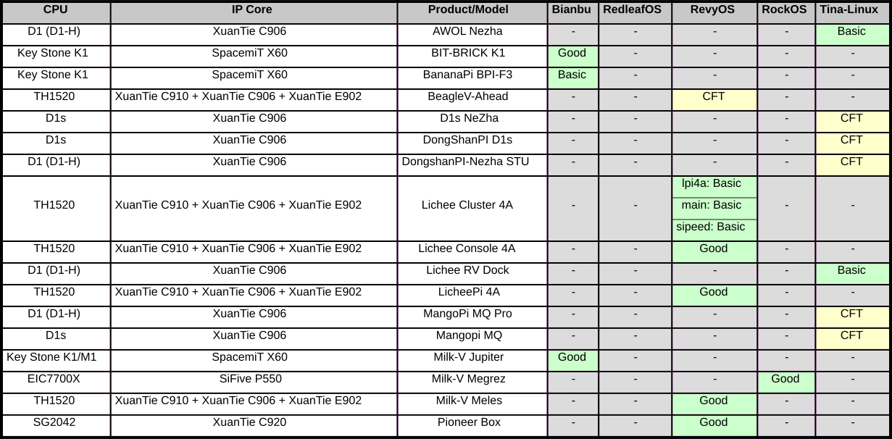
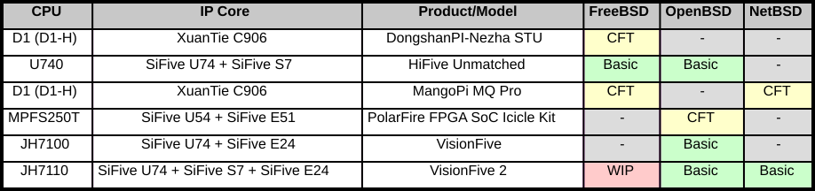
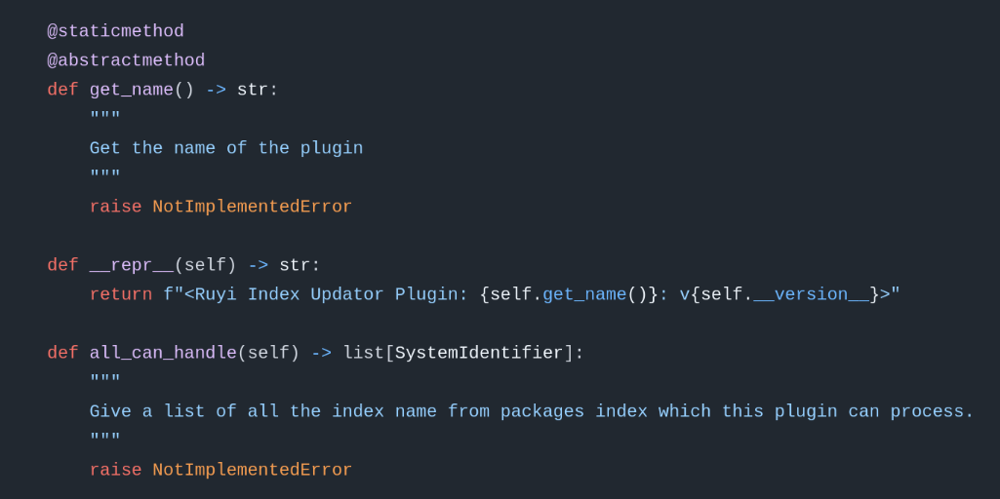
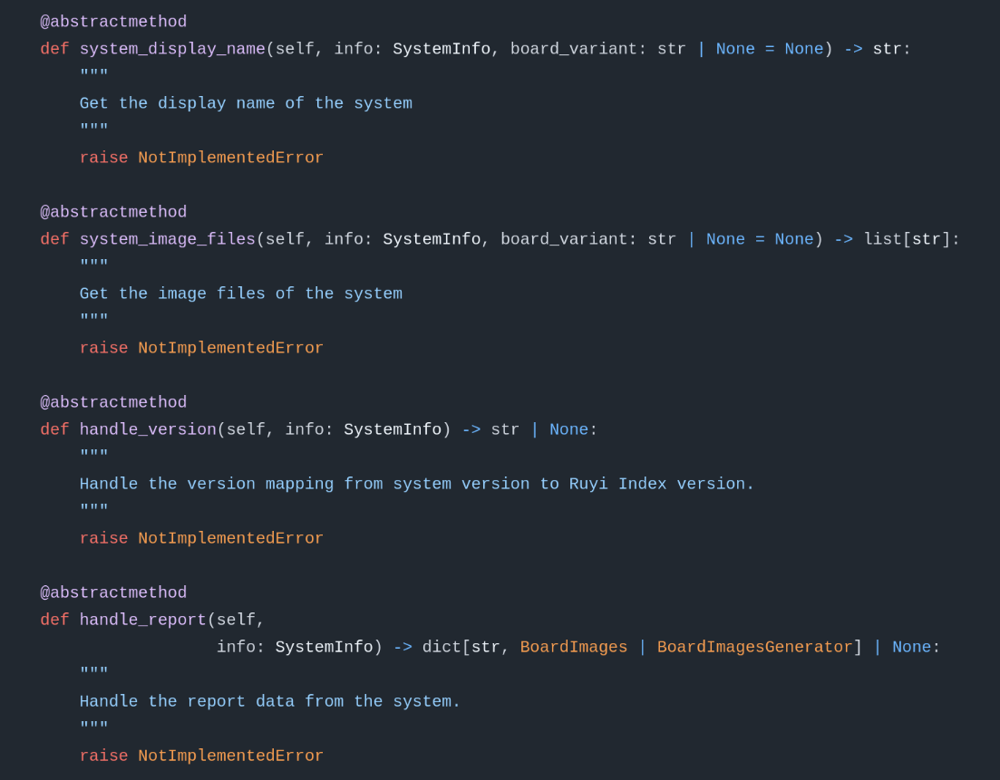
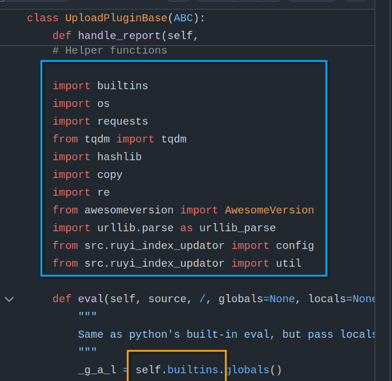
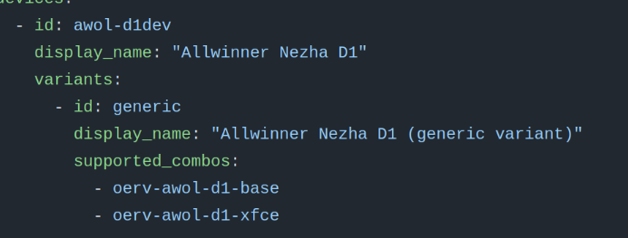

# 背景

## RuyiSDK

- 由 PLCTLab 制作的一款一站式的开发解决方案。包含了多个组成部分。
  - 包管理器
  - 工具链
  - 操作系统安装工具
  - IDE
  - 操作系统
  - ...
- 专为 RISC-V 开发者打造的全方位、集成式全功能开发环境， 打通RISC-V开发流程， 解决开发痛点
- 官网：[https://ruyisdk.org/](https://ruyisdk.org/)

## RISC-V 操作系统安装工具

使用 ruyi 工具，通过 `ruyi device provision` 命令进入。

其可以自动化的向主流开发板安装操作系统， 解决 RISC-V 镜像分散、安装方式不统一问题。 对于特别的需要配置环境的系统（如RTOS等）也有文档的支持。

```log
RuyiSDK Device Provisioning Wizard

This is a wizard intended to help you install a system on your device for your
development pleasure, all with ease.

You will be asked some questions that help RuyiSDK understand your device and
your intended configuration, then packages will be downloaded and flashed onto
the device's storage, that you should somehow make available on this host
system beforehand.
```

---

```log
The device has the following variants. Please choose the one corresponding to your hardware at hand:

  1. BananaPi BPI-F3 (generic)

Choice? (1-1) 1

The following system configurations are supported by the device variant you have chosen. Please pick the one you want to put on the device:

  1. bianbu  for BananaPi BPI-F3

Choice? (1-1) 1

We are about to download and install the following packages for your device:

 * board-image/bianbu-bpi-f3

Proceed? (y/N) 
```

## 支持矩阵

- 支持矩阵目前是RISC-V开发板x操作系统的一个支持列表、安装文档和测试结果的一个集合体。
- 包含了市面上常见RISC-V开发板及其镜像的信息
- 拥有各类开发板系统镜像的安装教程
- 对无法工作的镜像给予测试反馈和标明

仓库：[https://github.com/ruyisdk/support-matrix/](https://github.com/ruyisdk/support-matrix/)

---


---



---



---


## 同步背景

1. 支持矩阵的报告为人类可读的 Mardown 文档和各类文字化的说明

2. RuyiSDK 采用github packages-index仓库维护其软件包配置信息
   - [https://github.com/ruyisdk/packages-index](https://github.com/ruyisdk/packages-index)

3. 手动维护频繁、繁琐，更新不及时，配置信息繁杂。多处引用容易遗漏

4. 手动更新需要自行维护映射信息和规则等，不易进行协作

# packages-index 同步工具 V1

## 介绍

同步工具在support-matrix仓库中，以 `renew_ruyi_index.py` 作为入口点，通过CI自动调用。
合入新的测试报告后自动触发同步，更新软件包信息并同步到packages-index仓库。

- 自动更新软件包，并处理软件包信息中的各处引用
- 维护大量的元数据，将支持矩阵组织为更加机器可读的形式
- 提供元数据的处理接口

工具本体：[assets/src/ruyi_index_updator](https://github.com/ruyisdk/support-matrix/tree/main/assets/src/ruyi_index_updator)

## 支持矩阵结构

以 Lichee Pi 4A 为例来一窥整个支持矩阵的结构

```log

板子（eg：lpi4a）
|
|--- 系统（eg：revyos）
|       |
|       |--- 系统变体（eg：generic）
|
|--- 系统（eg：openeuler）
|       |
|       |--- 系统变体（eg：generic）
|       |
|       |--- 系统变体（eg：LTS）

```

## 镜像实际结构

以 Lichee Pi 4A 为例来一窥，如果我们刷写一个镜像需要的信息

```log

设备（eg：lpi4a）
|
|--- 设备版本（eg：lpi4a 8g ver.）
|     |
|     |--- 系统（eg：revyos）
|     |     |
|     |     |--- 系统变体（eg：generic）
|     |     |     |
|     |     |     |--- 文件（eg：u-boot 8g）
|     |     |     |
|     |     |     |--- 文件（eg：boot）
|     |     |     |
|     |     |     |--- 文件（eg：root）
...

```

其中包含的很多层级是不直接体现在支持矩阵中的

---

## metadata

为了对这两个差距巨大的层级进行映射，将一个镜像信息分为两部分：

### 镜像四元组
用于实际确定一个系统，较为简单，与其它工具（如上方看到的SVG图片、前端(WIP)等共享

### 镜像文件配置
与一个（或多个）镜像四元素对应，较为复杂，承担了大部分的配置任务

## 镜像四元组

通过一个四元组确定一个镜像

- vendor：sipeed-licheepi4a
- board_variant：8g
- system：revyos
- system_variant：null as generic

```{r,eval=TRUE,echo=FALSE,out.width="49%",out.height="30%",fig.cap="metadata",fig.show='hold',fig.align='center'}
knitr::include_graphics(c("./1.png", "./2.png"))
```

通过以上信息，我们能根据一份报告直接定位到一个（或多个）系统。

- `revyos-sipeed-lpi4a-8g-generic`
- `revyos-sipeed-lpi4a-16g-generic`

## 镜像文件配置

镜像文件配置需要实现以下功能：

- 能根据一个四元组及附带的 metadata，找到镜像
- 根据定义找到该版本镜像所有文件
- 定义其语义化版本号的映射规则
- 定义其格式化id

对此，将所有的镜像分为两个版本：简易版和标准版

## 结构说明

### Filter

根据（可选的）镜像信息过滤字符串，拥有 regex 和 lambda 两种方式

```yaml
type: regex
filter: ^revyos-pioneer.*\.img.*(?<!sum)$
```

### Mapper

将字符串和（可选的）版本信息映射到另一个字符串

- regex捕获组+python format string
- lambda函数

```yaml
type: lambda
mapper: 'lambda ver, info: [(m := re.match(r"(v)?(\d+)\.(\d+)(\.(\d+))?((-(?:(?!SP)\w+))*)(-SP(\d+))?((-(\w+))*)?((\+(\w+))*)?", ver), f"{m[2]}.{m[3]}.{m[5] or 0}-{m[9] or 0}{m[6] or ""}{m[10] or ""}{m[13] or ""}")[-1] for re in [__import__("re")]][0]'
```

## 镜像文件配置（简易版）

对于简易版镜像，需要大胆的做出如下假设：

- 一个板子只有一种
- 一个镜像只有一个文件
- 名称-id遵循标准映射格式

镜像便可被简化为如下格式：

```log
设备&设备版本
|
|--- 系统（eg：revyos）
|     |
|     |--- 系统变体&文件（eg：u-boot 8g）
```

---

以镜像位于某个镜像源为例（另一种为Github Release）：

```yaml
plugin: mirrorsite_getter_simple
vendor: bpi-f3
system: bianbu
variant: null
url:
    regex: .*
    mapper: https://archive.spacemit.com/image/k1/version/bianbu/{0}/
file_filter:
    type: lambda
    filter: 'lambda name, info: "desktop" in name and "k1" in name and "img" in name and "md5" not in name'
version_mapper:
    <<: *general_ver_mapper
desc_mapper:
    mapper: Official bianbu desktop image for Banana Pi F3 version {info.version}
```

## 镜像文件配置（复杂版）

镜像文件和板子版本是多对多的关系！

如对于 LPi4a，8/16g 共用 root/boot；每个版本有多个文件。

对于复杂版本，需要引入两个新的结构：

### 文件

镜像中的一个文件，可以属于某几个文件组

### 文件组

产生文件组属于的板子变体，及描述信息等。

## packages-index仓库镜像结构

```yaml
  - id: revyos-sipeed-lpi4a-8g
    display_name: "RevyOS for Sipeed LicheePi 4A (8G RAM)"
    packages:
      - board-image/revyos-sipeed-lpi4a
      - board-image/uboot-revyos-sipeed-lpi4a-8g
```

---

```yaml
format = "v1"
[[distfiles]]
name = "root-lpi4a-20241229_032148.ext4.zst"
urls = [ "https://mirror.iscas.ac.cn/revyos/extra/images/lpi4a/20241229/root-lpi4a-20241229_032148.ext4.zst",]
restrict = [ "mirror",]

[[distfiles]]
name = "boot-lpi4a-20250123_195216.ext4.zst"
urls = [ "https://mirror.iscas.ac.cn/revyos/extra/images/lpi4a/20241229/boot-lpi4a-20250123_195216.ext4.zst",]
restrict = [ "mirror",]

[metadata]
desc = "RevyOS 20241229 image for Sipeed LicheePi 4A"

[provisionable]
strategy = "fastboot-v1"

[provisionable.partition_map]
boot = "boot-lpi4a-20250123_195216.ext4"
root = "root-lpi4a-20241229_032148.ext4"
```

## 镜像文件配置（复杂版）

```yaml
plugin: mirrorsite_getter_std
vendor: sipeed-lpi4a
system: revyos
variant: null
board_variants: [ 8g, 16g ]
version_mapper:
    <<: *date_middle_mapper
strategy: fastboot-v1
url:
    regex: (.*)
    mapper: 'https://mirror.iscas.ac.cn/revyos/extra/images/lpi4a/{0}/'
```

---

```yaml
fileset:
    -   id: 'main'
        board_variants: null
        desc_mapper:
            mapper: 'RevyOS {info.version} image for Sipeed LicheePi 4A'
    -   id: 'uboot-8g'
        prepend: 'uboot'
        board_variants: [ 8g ]
        desc_mapper:
            mapper: 'U-Boot image for LicheePi 4A (8G RAM) and RevyOS {info.version}'
    -   id: 'uboot-16g'
        prepend: 'uboot'
        board_variants: [ 16g ]
        desc_mapper:
            mapper: 'U-Boot image for LicheePi 4A (16G RAM) and RevyOS {info.version}'
```

---

```yaml
files:
    -   id: "boot file"
        fileset: [ main ]
        file_filter:
            type: lambda
            filter: 'lambda name, info: "boot-" in name and "u-boot" not in name'
        partition_map: "boot"
        ...
    -   id: "uboot 8g file"
        fileset: [ uboot-8g ]
        ...
        partition_map: "uboot"
    -   id: "uboot 16g file"
        fileset: [ uboot-16g ]
        ...
        partition_map: "uboot"
```

## 镜像配置（插件版）

上面的配置方式还是太拘束了，有没有更自由的方式？

工具内置了插件系统，想要什么可以直接写一个Python类扔进去！

其实上面所有的配置，都是由预先写好的插件处理的，根据`plugin`字段进行传输。

## 插件接口



---



## 更新流程

```{r,eval=T,echo=F}
# DiagrammeR::grViz("
#   digraph graph2 {
  
#   graph [layout = dot, rankdir = LR]
  
#   # node definitions with substituted label text
#   node [shape = oval]
#   s [label = '加载所有插件，获取四元组']
#   a [label = '镜像id匹配四元组']
#   b [label = '映射版本号判断是否需要处理']
#   c [label = '选取插件和镜像信息，生成处理worker']
#   d [label = 'yield worker']
  
#   s -> a -> b -> c -> d
#   }",
#   height = 150)
```


```{r,eval=T,echo=F}
# DiagrammeR::grViz("
#   digraph graph2 {
  
#   graph [layout = dot, rankdir = LR]
  
#   # node definitions with substituted label text
#   node [shape = oval]
#   s [label = '插件生成更新后的manifest文件']
#   a [label = '根据manifest组名称更新对应包']
#   b [label = '更新，系统对软件包引用']
#   c [label = '更新，板子变体对系统引用']
  
#   s -> a -> b -> c
#   }",
#   height = 150)
```


# 存在的问题

## 插件 global 不存在

{ width=60% }

## 系统到 symver 的版本映射

```python
m = re.match(r"(v)?(\d+)\.(\d+)(\.(\d+))?((-(?:(?!SP)\w+))*)(-SP(\d+))?((-(\w+))*)?((\+(\w+))*)?", ver)
f"{m[2]}.{m[3]}.{m[5] or 0}-{m[9] or 0}{m[6] or ""}{m[10] or ""}{m[13] or ""}"
```

- 1.1 / 1.2.3 
- 2.1-rc / 2.2 / 2.3-SP1
- 3.1-LTS / 3.1.2-LTS-SP1 
- （3.4-LTS-SP5-rc+build5678）？
- datever

## 旧有的包/新包格式不统一

- 旧有包不遵循标准id的映射
- 版本号映射规则混乱
- 是否要添加反向映射信息？
- 是否将上游🔗分开处理？

## metadata 依然表意不够

1. 系统变体还可再分？
  - base
  - XFce



2. 如果同时需要生成脚本？

3. 配置文件仍然有些复杂，能否继续简化？

# 未来展望

## 未来展望

- 统一的规范
- 已经有了url/id等信息，能否直接检测上游版本？
- 镜像过多且部分是纯文档形式，能否直接对不存在插件的生成一个文档连接？