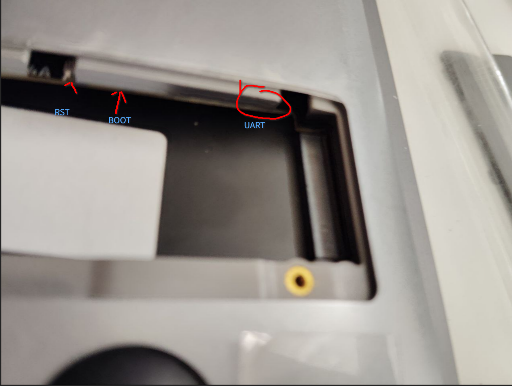

# RISC-V Laptop z14 安装指南

z14 硬件是基于 lm4a 和 lichee console 4a 的，所以基本差不多。可以很大程度上的参考 [console 4a 安装指南](https://wiki.sipeed.com/hardware/zh/lichee/th1520/lcon4a/4_burn_image.html)

## 准备工作

打开底端的 nvme 盖子，向内能看到两个按钮。左边的为 boot 按键，右边的为 reset 按键。若需要串口连接，此时能在最左边看到几个触点，第一个为 GND，第 **3、4** 为 RX/TX。



## 准备固件

*以下将 z14 的 u-boot 文件称作 u-boot.bin，根据实际文件名和路径进行替换*

z14 与 console 的设备树和 uboot 均不同，不能直接使用 console 的固件。需要使用 z14 的固件。

下载 uboot 和 FULL_IMG.squashfs 文件，使用 unsquashfs 解压 FULL_IMG.squashfs 文件。

```bash
unsquashfs FULL_IMG.squashfs
```

此时会得到 squashfs-root 文件夹，里面包含了 boot.ext4 和 root.ext4 两个文件。

## 烧录固件

其与 console 4a 的烧录方式一样，使用唯一的一个 USB-C 进行烧录。

连接电脑后，按住 boot 按键并按下电源键（在键盘上）启动系统。接下来通过 fastboot 烧录：
```bash
fastboot flash ram path/to/u-boot.bin
fastboot reboot
fastboot flash uboot path/to/u-boot.bin
fastboot flash boot path/to/boot.ext4
fastboot flash root path/to/root.ext4
```

## 启动系统

烧录完成后，按下 reset 按键重启系统。此时系统会自动启动。能在自带屏幕上看到启动信息和企鹅。
