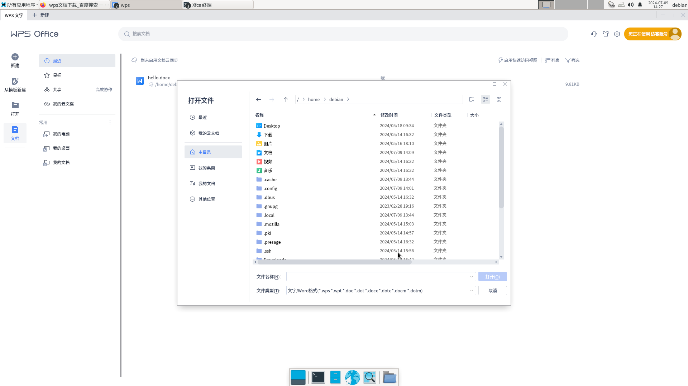
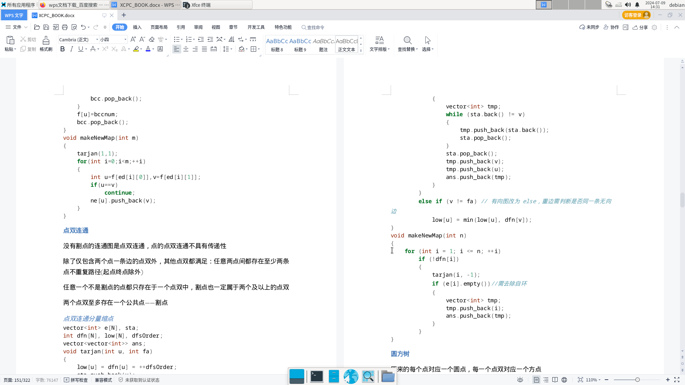
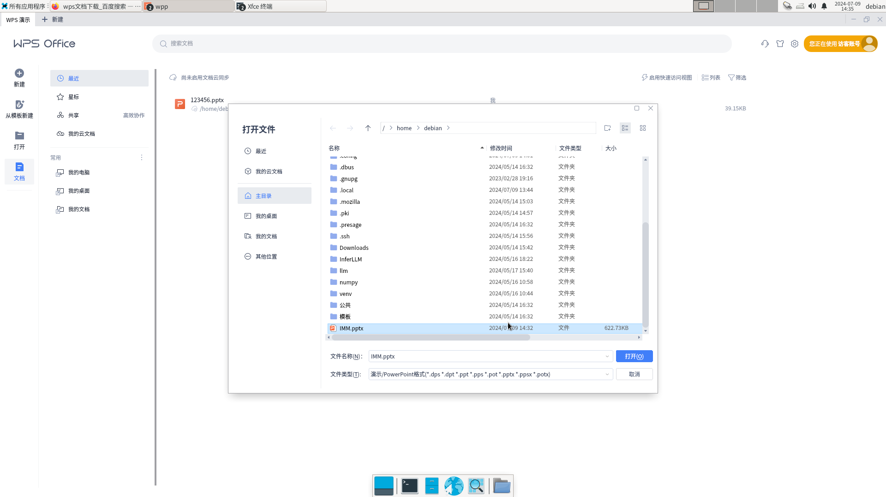
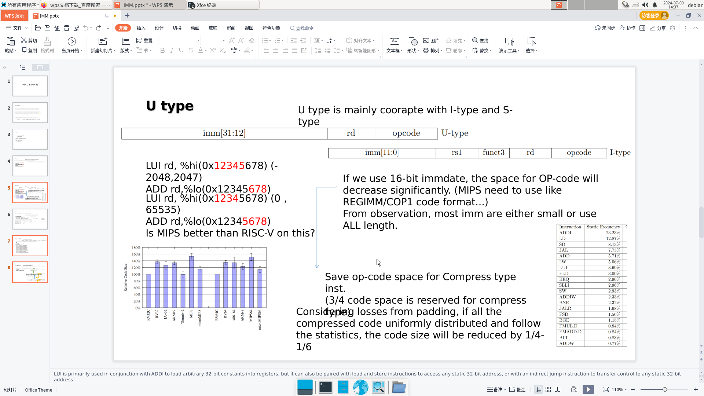

# Ruyi 0.14.0-beta WPS 测试报告

## 测试环境

### 硬件

- Pioneer Box v1.3

### 操作系统

- RevyOS 20240119-163959

## 安装步骤

0.14.0-beta 版本安装 WPS 可见：[文档](https://github.com/ruyisdk/packages-index/blob/main/news/2024-07-08-box64-wps-office-poc.zh_CN.md)

下载/更新 ruyi 后，配置与预发布版本软件包：
```bash
mkdir -p  ~/.config/ruyi
cat << EOF > ~/.config/ruyi/config.toml
[packages]
prereleases = true
EOF

```

接下来安装 Box64：
```bash
ruyi install box64-upstream
```

记住安装路径，按需替换接下来的各个路径。

配置 binfmt_misc：
```bash
vim ~/.local/share/ruyi/binaries/riscv64/box64-upstream-0.2.8-ruyi.20240702/etc/binfmt.d/box64.conf
# in vim
:%s/\/bin\/box64/\/.local\/share\/ruyi\/binaries\/riscv64\/box64-upstream-0.2.8-ruyi.20240702\/bin\/box64/g
# out vim

sudo cp ~/.local/share/ruyi/binaries/riscv64/box64-upstream-0.2.8-ruyi.20240702/etc/binfmt.d/box64.conf /etc/binfmt.d/box64.conf
sudo systemctl restart systemd-binfmt

```

安装 sysroot：
```bash
wget https://mirror.iscas.ac.cn/ruyisdk/dist/temp/debian-bookworm.gui.20240705.amd64.tar.zst

sudo mkdir /opt/debian-bookworm.amd64
pushd /opt/debian-bookworm.amd64
sudo tar -xf ~/Downloads/debian-bookworm.gui.20240705.amd64.tar.zst
popd
```

安装 WPS Office：
```bash
ruyi install --host x86_64 wps-office
```

手动下载 WPS 后，放到命令提示位置，再次：
```bash
ruyi install --host x86_64 wps-office
```

调整脚本：
```bash
pushd ~/.local/share/ruyi/binaries/x86_64/wps-office-11.1.0-r.11719

sed -i "s@gInstallPath=/@gInstallPath=$(pwd)/@" ./usr/bin/*

popd
```

配置环境变量：
```bash
echo "export BOX64_EMULATED_LIBS=libsqlite3.so.0" >> ~/.bashrc
echo "export BOX64_LD_LIBRARY_PATH=/opt/debian-bookworm.amd64/usr/lib/x86_64-linux-gnu" >> ~/.bashrc

source ~/.bashrc
```

## 测试结果

### wps（文字）

```bash
~/.local/share/ruyi/binaries/x86_64/wps-office-11.1.0-r.11719/usr/bin/wps
```

测试成功，能正常打开、编辑、保存文档。


打开文档


编辑文档

### wpp（幻灯片）

```bash
~/.local/share/ruyi/binaries/x86_64/wps-office-11.1.0-r.11719/usr/bin/wpp
```

测试成功，能正常打开、编辑、保存文档。


打开文档


编辑文档

### et（表格）

```bash
~/.local/share/ruyi/binaries/x86_64/wps-office-11.1.0-r.11719/usr/bin/et
```

测试失败，无法正常运行。

### wpspdf（pdf）

```bash
~/.local/share/ruyi/binaries/x86_64/wps-office-11.1.0-r.11719/usr/bin/wpspdf
```

测试失败，无法正常运行。
